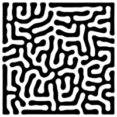
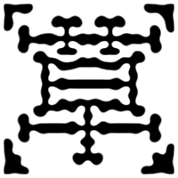
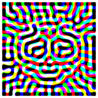

# Interactive-Reaction-Diffusion-Simulator

## Recommended Environment
This tool is designed for use on a PC with the Google Chrome browser. Operation on other devices or browsers is not guaranteed.

## 推奨環境
このツールは、PC上のGoogle Chromeブラウザでの使用を想定しています。他のデバイスやブラウザでの動作は保証されていません。

## Demo
You can try this tool on the page below.

https://black-sesame-ice-cream.github.io/Interactive-Reaction-Diffusion-Simulator/

## デモ
以下のページでこのツールを試すことができます。

https://black-sesame-ice-cream.github.io/Interactive-Reaction-Diffusion-Simulator/

## Overview
This is an interactive web-based simulator for creating reaction-diffusion patterns. You can draw on the canvas with your mouse, add text, or load your own images to serve as a seed for generating intricate, organic patterns. 

## 概要
これは、反応拡散系のパターンを生成するインタラクティブなWebシミュレーターです。マウスでキャンバスに描画したり、テキストを追加したり、独自の画像を読み込ませたりすることで、複雑で有機的なパターンの生成元とすることができます。

## Controls
The simulation can be controlled via the GUI panel, mouse actions, and keyboard hotkeys.

### GUI
- **Actions**: Load/submit images, clear the canvas, and save the result.
- **Quality & Performance**: Change the processing resolution (requires a page reload).
- **Appearance**: Toggle the border color.
- **Pattern Controls**: Adjust the scale of the generated patterns.
- **Drawing Tools**:
    - **Cursor**: Change the brush size and color.
    - **Text**: Input text, adjust its size, weight, and colors, and toggle fonts before submitting it to the canvas.
    - **Random Points**: Set the count and size for randomly generated points.

### Mouse
- **Drag**: Draw on the canvas with the selected cursor color and radius.

### Keyboard
- **Space Bar**: Toggle play/pause for the simulation.
- **Number keys (0-9)**: When paused, step forward a specific number of frames (0 advances 10 frames).
- **b**: Toggle cursor color.
- **c**: Clear the canvas to white.
- **r**: Generate random points on the canvas.
- **t**: Submit the text from the GUI to the canvas.
- **i**: Submit the loaded image from the GUI to the canvas.
- **v**: Toggle border color.
- **s**: Save the current canvas as a PNG image.

## 操作
シミュレーションの操作は、GUIパネル、マウス、およびキーボードのホットキーで行うことができます。

### GUI
- **Actions**: 画像の読み込みと適用、キャンバスのクリア、結果の保存。
- **Quality & Performance**: 処理解像度の変更（ページのリロードが必要）。
- **Appearance**: 境界線の色の切り替え。
- **Pattern Controls**: 生成されるパターンのスケールを調整。
- **Drawing Tools**:
    - **Cursor**: ブラシのサイズと色を変更。
    - **Text**: テキストを入力し、そのサイズ、太さ、色を調整し、フォントを切り替えてからキャンバスに適用。
    - **Random Points**: ランダムに生成される点の数とサイズを設定。

### マウス
- **ドラッグ**: 選択されたカーソルの色と半径でキャンバスに描画します。

### キーボード
- **スペースキー**: シミュレーションの再生/一時停止を切り替えます。
- **数字キー (0-9)**: 一時停止中に、指定したフレーム数を進めます（0は10フレーム進みます）。
- **b**: カーソルの色を切り替えます。
- **c**: キャンバスを白でクリアします。
- **r**: キャンバス上にランダムな点を生成します。
- **t**: GUIのテキストをキャンバスに適用します。
- **i**: 読み込んだ画像をキャンバスに適用します。
- **v**: 境界線の色を切り替えます。
- **s**: 現在のキャンバスをPNG画像として保存します。

## Tech Stack
- **p5.js**: Core library for drawing and canvas management.
- **WebGL / GLSL**: Used for the reaction-diffusion effect via custom shaders (Blur and Unsharp Mask).
- **lil-gui**: For the interactive user interface panel.
- **HTML / CSS / JavaScript**: The fundamental technologies for this web application.
